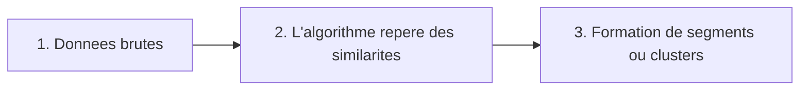
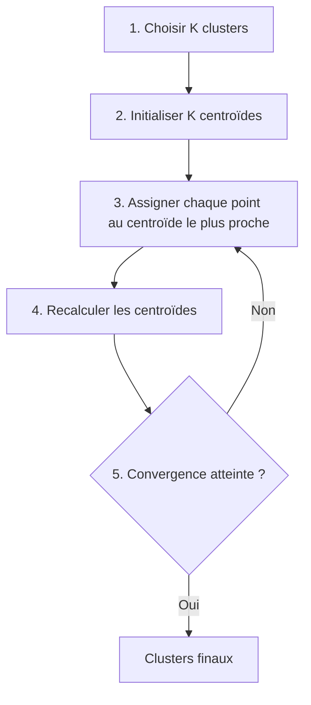
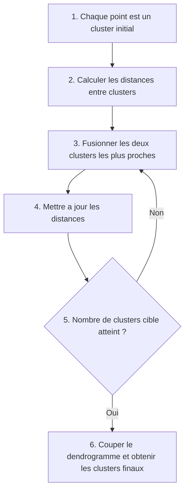
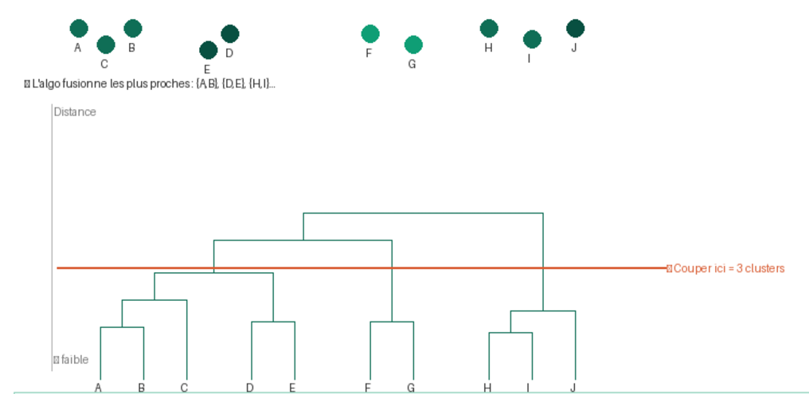
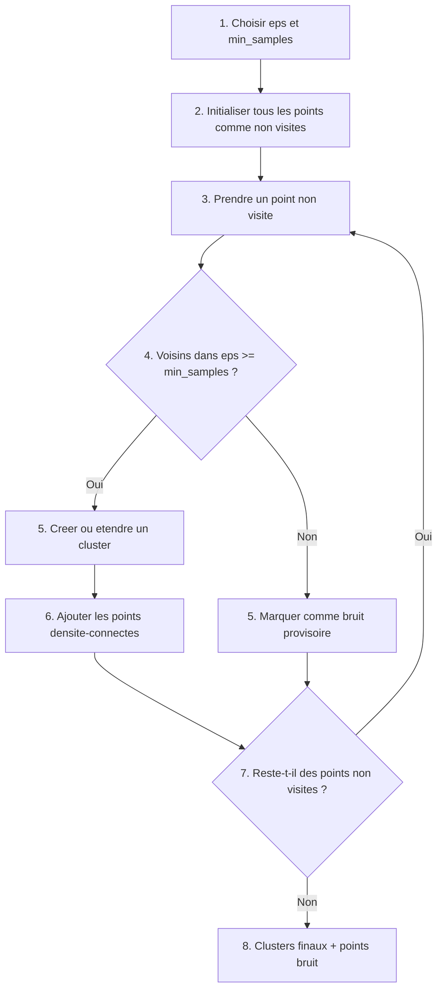

### Un algorithme de classification non supervisée aussi appelé apprentissage non supervié consiste à laisser un algorithme trouver tout seul des groupes dans les données sans étiquettes connues à l'avance.

### Processus:

### Algorithme de classification non supervisée

#### K-Means

Le K-Means est un algorithme de clustering non supervisé qui regroupe automatiquement les données en K clusters selon leur similarité en minimisant la distance entre chaque point et le centre de son cluster.

#### Schéma de fonctionnement (étape par étape)

#### Source:
1. Scikit-learn, Unsupervised learning (vue d’ensemble)  
https://scikit-learn.org/stable/unsupervised_learning.html

2. Scikit-learn, Clustering (inclut K-Means et son principe itératif)  
https://scikit-learn.org/stable/modules/clustering.html

3. Scikit-learn, KMeans API (paramètres, convergence, implémentation)  
https://scikit-learn.org/stable/modules/generated/sklearn.cluster.KMeans.html

4. MacQueen, J. (1967), Some Methods for Classification and Analysis of Multivariate Observations (papier fondateur de K-Means)  
https://projecteuclid.org/euclid.bsmsp/1200512992

5. Lloyd, S. (1982), Least Squares Quantization in PCM (algorithme de Lloyd souvent associé à K-Means)  
https://ieeexplore.ieee.org/document/1056489

6. Arthur, D. and Vassilvitskii, S. (2007), k-means++: The Advantages of Careful Seeding  
https://theory.stanford.edu/~sergei/papers/kMeansPP-soda.pdf

#### La CAH (Classification Ascendante Hiérarchique)

Une méthode de clustering non supervisé qui regroupe progressivement les points les plus proches pour construire un dendrogramme, puis le coupe à un niveau choisi pour obtenir les clusters.

#### Schéma de fonctionnement (étape par étape)

#### Sources CAH:
1. Scikit-learn, Clustering hiérarchique
https://scikit-learn.org/stable/modules/clustering.html#hierarchical-clustering

2. Scikit-learn, AgglomerativeClustering (API)
https://scikit-learn.org/stable/modules/generated/sklearn.cluster.AgglomerativeClustering.html

3. SciPy, cluster.hierarchy (linkage, dendrogram)
https://docs.scipy.org/doc/scipy/reference/cluster.hierarchy.html

4. Ward, J. H. (1963), Hierarchical Grouping to Optimize an Objective Function
https://doi.org/10.1080/01621459.1963.10500845

#### DBSCAN

Le DBSCAN est un algorithme de clustering non supervisé basé sur la densité, qui regroupe les points proches en clusters et identifie les points isolés comme du bruit.

#### Paramètres clés

1. eps (epsilon): rayon de voisinage autour d'un point.
2. min_samples: nombre minimum de points dans ce rayon pour qu'un point soit considéré comme un point coeur.

#### Schéma de fonctionnement (étape par étape)

#### Sources DBSCAN:
1. Scikit-learn, DBSCAN (section Clustering)
https://scikit-learn.org/stable/modules/clustering.html#dbscan

2. Scikit-learn, DBSCAN API
https://scikit-learn.org/stable/modules/generated/sklearn.cluster.DBSCAN.html

3. Ester, M., Kriegel, H.-P., Sander, J., Xu, X. (1996), A Density-Based Algorithm for Discovering Clusters in Large Spatial Databases with Noise
https://cdn.aaai.org/KDD/1996/KDD96-037.pdf

4. Schubert, E. et al. (2017), DBSCAN Revisited, Revisited
https://doi.org/10.1145/3068335

# customer-personality-analysis
“Statistics show that statistics cannot be trusted.”
